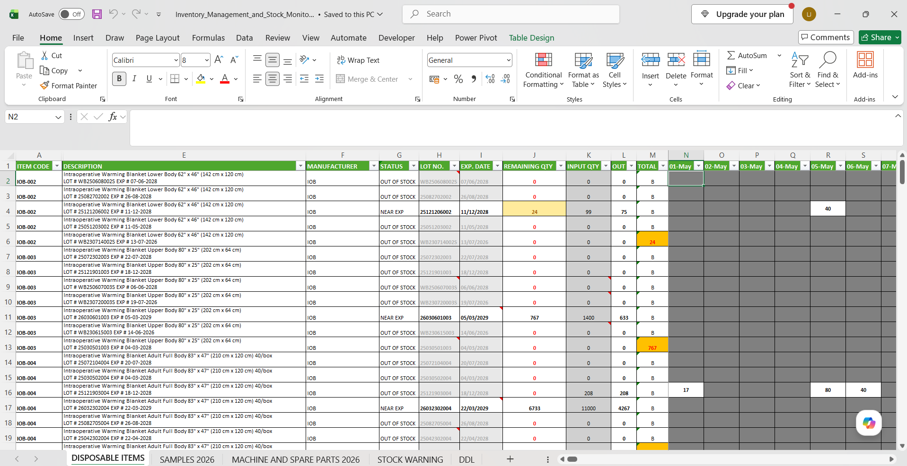
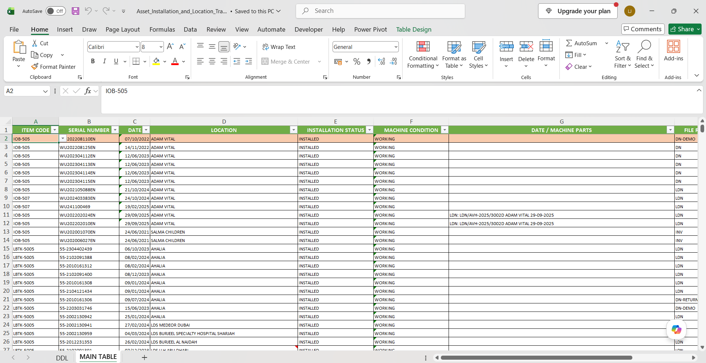
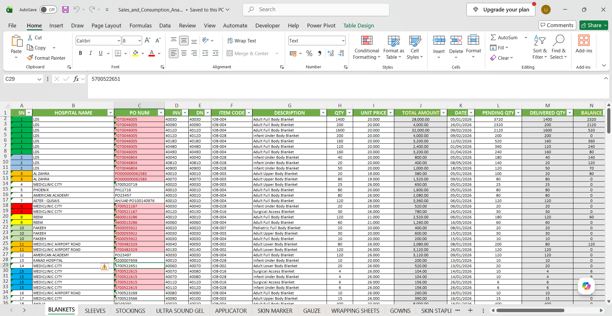
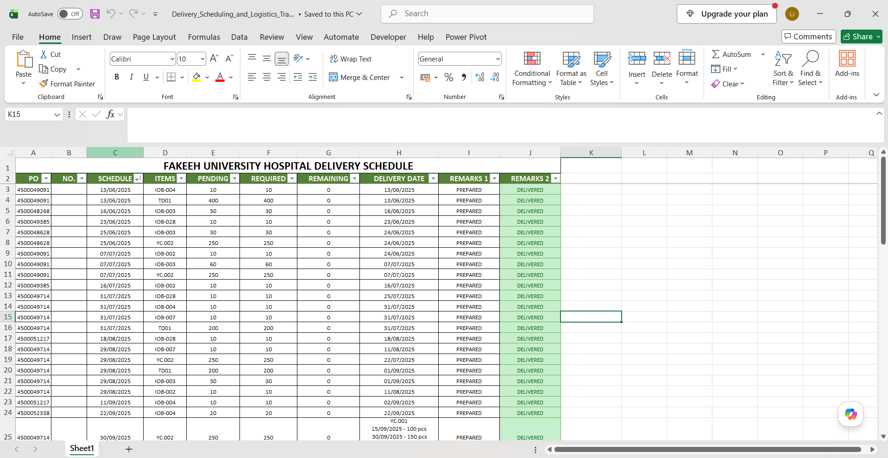
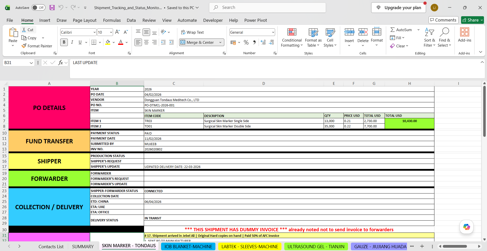

# Operations Analytics Using Excel

This repository showcases Excel-based operational monitoring and reporting solutions that I developed and maintained during my role as an **Administrative Assistant (Operations Reporting & Monitoring) at EOC Medical Supplies LLC**.

These workbooks were actively used to support inventory control, equipment monitoring, sales and consumption reporting, shipment coordination, and delivery planning within a healthcare distribution environment.

The files included in this repository have been anonymized to remove confidential company information while preserving the reporting methodologies and analytical approaches used in practice.

---

## Professional Experience Context

At EOC Medical Supplies LLC, I was responsible for maintaining several operational monitoring workbooks used by management and internal teams to track inventory movement, machine installations, product consumption, shipment status, and delivery schedules.

These tools improved visibility into day-to-day operations, reduced manual follow-ups, and supported timely decision-making through structured reporting.

---

# Sample Screenshots

The screenshots below were taken from anonymized versions of the operational monitoring workbooks that I maintained during my role at **EOC Medical Supplies LLC**. They illustrate the reporting structures and monitoring approaches used to support day-to-day healthcare operations.

## Inventory Management and Stock Monitoring

Supports inventory control by tracking stock availability, stock movement, replenishment requirements, and inventory status across multiple product categories.

---

## Asset Installation and Location Tracker

Used to monitor machine installations, equipment deployment status, operational progress, and machine locations.

---

## Sales and Consumption Analysis

Tracks product sales, consumption patterns, delivery fulfillment, and product utilization trends to support operational planning.

---

## Delivery Scheduling and Logistics Tracker

Provides visibility into planned deliveries and supports coordination between stakeholders to ensure timely execution.

---

## Shipment Tracking and Status Monitoring

Monitors shipment progress, supplier communications, purchase order status, and estimated delivery timelines to improve supply chain visibility.

---

# Projects Included

## 1. Inventory Management and Stock Monitoring

**File:** `Inventory_Management_and_Stock_Monitoring.xlsx`

### Purpose

* Monitor disposable item inventory
* Track sample inventory movement
* Manage machine and spare parts inventory
* Identify low-stock situations requiring replenishment
* Monitor expiry dates and inventory availability

### Tools and Techniques Used

* Multi-sheet workbook design
* Inventory transaction logging
* Running balance calculations
* Data validation lists
* Lookup/reference tables
* Conditional stock monitoring
* Expiry tracking
* Formula-driven reporting

### Skills Demonstrated

* Inventory Analytics
* Stock Monitoring
* Inventory Control
* Operational Reporting
* Data Accuracy Management

---

## 2. Asset Installation and Location Tracker

**File:** `Asset_Installation_and_Location_Tracker.xlsm`

### Purpose

* Track machine installations
* Monitor equipment deployment status
* Record machine locations
* Maintain maintenance history
* Monitor equipment conditions

### Tools and Techniques Used

* Macro-enabled Excel workbook (.xlsm)
* Status tracking
* Reference tables
* Data validation
* Asset registry maintenance
* Preventive maintenance monitoring

### Skills Demonstrated

* Asset Management
* Equipment Tracking
* Process Monitoring
* Reporting and Documentation
* Operational Coordination

---

## 3. Sales and Consumption Analysis

**File:** `Sales_and_Consumption_Analysis.xlsx`

### Purpose

* Monitor product sales and consumption
* Track product utilization
* Monitor delivery fulfillment
* Identify pending and completed transactions
* Analyze product demand trends

### Tools and Techniques Used

* Product-level transaction tracking
* Multi-sheet categorization
* Quantity reconciliation
* Balance calculations
* Revenue calculations
* Order status monitoring
* Formula-driven analysis

### Skills Demonstrated

* Sales Analysis
* Consumption Analysis
* Trend Monitoring
* KPI Reporting
* Transaction Reconciliation

---

## 4. Delivery Scheduling and Logistics Tracker

**File:** `Delivery_Scheduling_and_Logistics_Tracker.xlsx`

### Purpose

* Coordinate delivery schedules
* Monitor delivery timelines
* Support communication between stakeholders
* Improve visibility into planned deliveries

### Tools and Techniques Used

* Schedule monitoring
* Calendar-based coordination
* Delivery planning
* Stakeholder reporting
* Logistics coordination

### Skills Demonstrated

* Logistics Coordination
* Schedule Management
* Operations Planning
* Stakeholder Communication
* Reporting Support

---

## 5. Shipment Tracking and Status Monitoring

**File:** `Shipment_Tracking_and_Status_Monitoring.xlsx`

### Purpose

* Track shipment progress
* Monitor supplier communications
* Record purchase order status
* Monitor estimated delivery timelines
* Consolidate shipment updates

### Tools and Techniques Used

* Shipment lifecycle monitoring
* Purchase order tracking
* ETD and ETA monitoring
* Contact management
* Supplier follow-up tracking
* Exception monitoring
* Summary reporting
* Multi-source data consolidation

### Skills Demonstrated

* Supply Chain Reporting
* Shipment Analytics
* Procurement Monitoring
* Vendor Coordination
* Operational Analytics

---

# Technologies and Reporting Techniques Used

## Microsoft Excel Features

* Advanced Excel
* Multi-sheet workbook architecture
* Data Validation
* Drop-down Lists
* Conditional Formatting
* Lookup and Reference Tables
* Formula-driven reporting
* Running balance calculations
* Quantity reconciliations
* Date-based tracking
* Status monitoring
* Macro-enabled workbooks

## Reporting Techniques

* Operational Monitoring
* Inventory Reporting
* Shipment Status Reporting
* Asset Tracking
* Sales and Consumption Reporting
* Delivery Coordination
* Exception Reporting
* Transaction Reconciliation
* Supply Chain Visibility

---

# Business Impact

These monitoring workbooks played an important role in supporting healthcare operations by:

* Improving visibility into inventory and stock availability.
* Supporting machine deployment and maintenance tracking.
* Monitoring product consumption and fulfillment status.
* Improving shipment and delivery coordination.
* Enhancing reporting accuracy.
* Reducing reliance on manual follow-ups through centralized monitoring.

---

# Disclaimer

The original workbooks contained confidential operational information belonging to EOC Medical Supplies LLC. The versions shared in this repository have been modified and anonymized to remove company-sensitive data while preserving the reporting structures, analytical methodologies, and operational approaches used in practice.

---

# About Me

I am a Data Analyst and IT Professional with experience in banking systems support, operational reporting, inventory monitoring, procurement coordination, and business process improvement. I enjoy transforming operational data into meaningful insights that support informed decision-making and operational efficiency.

**GitHub:** https://github.com/leoloujeffreydev
